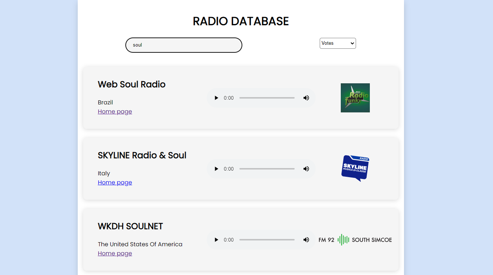

# Radio Database

## Description

A database where you can dinamically search and play for a list of more than 40.000 radio stations



## Getting Started

### Dependencies

* React
* Node

### Installing

```
git clone https://github.com/Xavii22/Radio-Database.git
```

### Executing program

```
npm install
```
```
npm start
```


## Acknowledgments

API used to get the list of radios:

[Radio Browser API](http://91.132.145.114/)